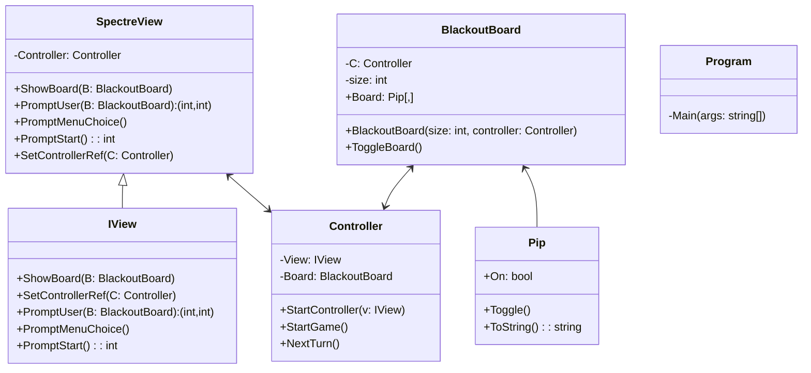

BlackOut

João Amaral - Criação do menu, spawn random de células ligadas, documentação do relatório

Francisco Rosa - Comentário do código, adição do Spectre.Console em algumas linhas de código e mensagem de vitória quando o jogador liga todas as pips

Francisco Caldeira - Criação do modelo MVC, inicialização do repositório git, e correção de bugs

Repositório github: https://github.com/YellowPaintGames/Blackout---Projeto-Final-LP
---
Bibliotecas usadas: Spectre.Console
---
<h1>REFERÊNCIAS/BIBLIOGRAFIA</h1>

 https://spectreconsole.net/console/reference/color-reference
 https://spectreconsole.net/console/widgets/text
 https://spectreconsole.net/console/widgets/figlet
 https://www.geeksforgeeks.org/c-sharp/c-sharp-tuple
 https://www.youtube.com/watch?v=gXAbvu_ZB04&list=PLLWMQd6PeGY0IReztlVcGLVZk9mzc4Hvr&index=1

---
BlackoutBoard: A classe responsável pela informação dentro do Board, e a sua lógica

Controller: A classe responsável por começar o jogo e chamar a proxima jogada

IView: A classe responsável pela cena de mostrar coisas (no nosso caso usando Specter.Console) para mostrar a área de jogo

Pip: A classe responsável pelas celulas, que tem 2 estados, ligado ou desligado

SpectreView: A classe responsável pelo que vai ser utilizado para mostrar o tabuleiro

Program: O início do programa

---
